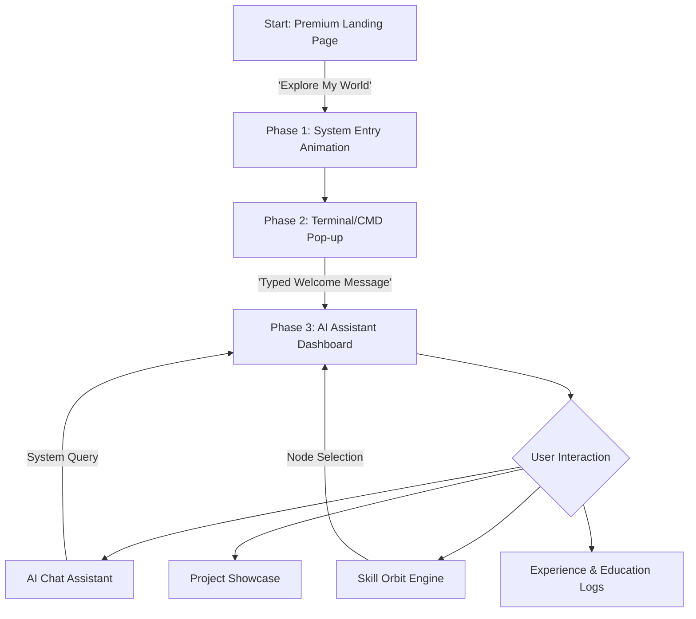

# AskNarayan - Project Architecture & Flow

Welcome to **AskNarayan**, a high-end, interactive AI-powered portfolio designed to move beyond the traditional "scroll-only" experience. This document describes the system's architecture, design philosophy, and user journey.

---

## 🚀 The Vision
Most portfolios are static. **AskNarayan** is a living "System Entry" experience. It treats the visitor not just as a reader, but as a **system user**. The goal is to showcase technical expertise through a premium, SaaS-level interface that emphasizes interactivity and intelligent assistance.

---

## 🗺️ User Journey (The Flow)

### 1. The Landing Page (The Hook)
The first thing a user sees is a high-contrast, blueprint-grid background with "Portfolio v2.0" and "System Online" status badges. 
*   **The Message**: "DON'T JUST SCROLL... INTERACT WITH IT."
*   **Aesthetics**: Glassmorphism, mesh gradients, and subtle falling particles.

### 2. The System Boot (The Transition)
Clicking the CTA initiates a "Linking Systems" pulse animation. A macOS-style terminal window (CMD) appears and types out a welcome message in real-time. This phase confirms the "User" has gained access to the workspace.

### 3. The Dashboard (The Core)
The main portfolio is structured as a **Professional Workspace**:
*   **Left Sidebar**: Quick navigation and theme toggles.
*   **Center Workspace**: The actual content (About, Experience, etc.) rendered with smooth Framer Motion transitions.
*   **Right Panel**: "Recent Projects" live-feed, keeping the user updated on latest work.
*   **AI Assistant**: A persistent chat interface where the user can "Ask Narayan" questions.

---

## 🛠️ Tech Stack & Implementation

- **Framework**: [React](https://reactjs.org/) (Vite)
- **Styling**: [Tailwind CSS](https://tailwindcss.com/) for a utility-first, performant UI.
- **Animations**: [Framer Motion](https://www.framer.com/motion/) for system-level transitions and orbit physics.
- **Icons**: [React Icons](https://react-icons.github.io/react-icons/) (Feather/Fi set).
- **Data Model**: Centralized `Profile.json` for easy content updates.

---

## 💎 Design Philosophy

1.  **SaaS-Level Aesthetics**: Inspired by platforms like Linear, Vercel, and Framer. Uses deep blues, indigos, and sharp contrasts.
2.  **Glassmorphism**: Extensive use of `backdrop-blur` and semi-transparent borders to create depth.
3.  **Responsiveness**: A complex grid-and-padding layout ensures the sidebar, dashboard, and panels adapt perfectly to mobile and desktop screens.
4.  **Micro-Interactions**: Every hover and click has a purpose—from glowing orbital skills to terminal typing effects.

---

## 📂 Core Directory Structure

- `/src/components/layout/`: Global elements like Sidebar, MobileNav, and LandingPage.
- `/src/components/sections/`: Modular dashboard components (Skills, Experience, Projects).
- `/src/data/Profile.json`: The "Brain" of the portfolio containing all raw content.
- `/src/App.jsx`: The "Orchestrator" managing the Landing → Dashboard state.

---

> [!TIP]
> To update the content of this portfolio, simply modify the `src/data/Profile.json` file. The UI will automatically re-render and scale to fit the new data.
